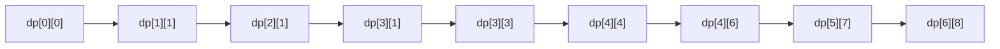

## Técnicas utilizadas
Programación dinámica con enfoque **Bottom-Up (tabulación)**. Se construye una matriz donde cada posición representa si un sufijo de la cadena coincide con un sufijo del patrón. En lugar de resolver el problema recursivamente, se resuelven primero los subproblemas más pequeños y luego se utilizan esos resultados para construir la solución final. Cada combinación posible de índices (estados) se resuelve una única vez y se almacena en la matriz.

## Idea de la solución
El problema pide verificar si una cadena `s` matchea un patrón `p` que puede contener `.` (cualquier carácter) y `*` (cero o más repeticiones del carácter anterior).

La solución construye una matriz llamada 'dp' de tamaño $(m+1) \times (n+1)$, donde:
`dp[i][j] = True` si el sufijo `s[i:]` coincide con el sufijo `p[j:]`. 

La matriz se completa desde la esquina inferior derecha hacia la superior izquierda, ya que cada estado depende únicamente de estados "más adelante" en la cadena y el patrón. 

Para cada posición se evalúa primero si el carácter actual coincide:
- Ambos caracteres son iguales.
- El patrón contiene `.`, que representa cualquier carácter.

El caso base es: 
- Si tanto la cadena como el patrón fueron completamente consumidos, entonces existe coincidencia. Por ello: `dp[m][n] = True`

Para cada posición se determina primero si el carácter actual coincide: 

```python
first_match = (
    i < m and
    (s[i] == p[j] or p[j] == '.')
) 
```

Luego existen dos posibles caminos a tomar:
- **Caso 1**: el siguiente carácter del patrón es `*`. Esto ramifica en 2 posibles opciones:
	- **Opción 1:** El `*` consume cero ocurrencias (representa cero apariciones). Se ignora el par x* y se consulta `dp[i][j+2]`.
    - **Opción 2:** El `*` consume una ocurrencia (carácter). Si existe coincidencia entre los caracteres actuales, se consume un carácter de la cadena permaneciendo sobre el mismo lugar del patrón para poder consumir más repeticiones, consultando `dp[i+1][j]`. Entonces, resulta: `first_match and dp[i + 1][j]`  
    Basta con que una de ambas opciones sea verdadera. 

- **Caso 2:** no hay `*`  
    Debe existir coincidencia entre los caracteres actuales y luego avanzar simultáneamente una posición tanto en la cadena como en el patrón, donde el resto de la cadena debe coincidir con el resto del patrón, utilizando `dp[i+1][j+1]`. Por lo tanto, resulta: `first_match and dp[i + 1][j + 1]` 

Una vez completada toda la matriz, la respuesta buscada queda almacenada en `dp[0][0]`.

## Código
```python
def is_match(s: str, p: str) -> bool:
    m = len(s)
    n = len(p)

    # Matriz de programación dinámica
    dp = [[False] * (n + 1) for _ in range(m + 1)]

    dp[m][n] = True

    for i in range(m, -1, -1):
        for j in range(n - 1, -1, -1):

            first_match = (
                i < m and
                (s[i] == p[j] or p[j] == '.')
            )

            if j + 1 < n and p[j + 1] == '*':
                dp[i][j] = (
                    dp[i][j + 2] or
                    (first_match and dp[i + 1][j])
                )
            else:
                dp[i][j] = (
                    first_match and
                    dp[i + 1][j + 1]
                )

    return dp[0][0]
```
## Traza de ejemplo
Buscamos la solución para
- **String:** addbzc
- **Patrón**: ad\*ba\*.c

En este enfoque no existen llamadas recursivas, sino que se completa la tabla desde abajo hacia arriba. A continuación se muestran únicamente los estados relevantes que conducen al resultado final.

| Estado | Subcadena | Subpatrón | Acción |
|:-|:-|:-|:-|
| **dp[6][8]** | "" | "" | Caso base. La cadena y el patrón han finalizado, por lo que dp[6][8] = True. |
| **dp[5][7]** | "c" | "c" | `c` coincide con `c`. Como no hay `*`, el resultado depende de `dp[6][8]`, que es `True`. |
| **dp[4][6]** | "zc" | ".c" | `.` coincide con cualquier carácter ('z'). El resultado depende de `dp[5][7]`, que es `True`. |
| **dp[4][4]** | "zc" | "a*.c" | El siguiente carácter del patrón es `*`. Como `z` no coincide con `a`, `first_match` es `False`. La única alternativa es omitir el bloque `a*`, avanzando hasta `dp[4][6]`, que es `True`. |
| **dp[3][3]** | "bzc" | "ba*.c" | `b` coincide con `b`. Como no hay `*` después de `b`, el resultado depende de `dp[4][4]`, que es `True`. |
| **dp[3][1]** | "bzc" | "d\*ba\*.c" | El siguiente carácter del patrón es `*`. Como `b` no coincide con `d`, `first_match` es `False`. El algoritmo omite el bloque `d*`, avanzando hasta `dp[3][3]`, que es `True`. |
| **dp[2][1]** | "dbzc" | "d\*ba\*.c" | `d` coincide con `d` y el siguiente carácter es `*`. El algoritmo puede elegir entre omitir `d*` (`dp[2][3]`, que es `False`) o consumir una `d` permaneciendo en el mismo patrón (`dp[3][1]`, que es `True`). Como una de las alternativas es `True`, `dp[2][1] = True`. |
| **dp[1][1]** | "ddbzc" | "d\*ba\*.c" | `d` coincide con `d`. Al igual que en el estado anterior, el algoritmo evalúa omitir `d*` (`dp[1][3]`, `False`) o consumir otra `d` (`dp[2][1] = True`). La segunda alternativa conduce al éxito, por lo que `dp[1][1] = True`. |
| **dp[0][0]** | "addbzc" | "ad\*ba\*.c" | `a` coincide con `a`. Como no hay `*`, el resultado depende de `dp[1][1]`, que es `True`. Por tanto, `dp[0][0] = True`. La cadena matchea con el patrón. |

### Matriz 'dp'
| dp[i][j] | 0 (a) | 1 (d) | 2 (*) | 3 (b) | 4 (a) | 5 (*) | 6 (.) | 7 (c) | 8 ("") |
|:-|:-|:-|:-|:-|:-|:-|:-|:-|:-|
| 0 (a) | **T** | F | F | F | F | F | F | F | F |
| 1 (d) | F | **T** | F | F | F | F | F | F | F |
| 2 (d) | F | **T** | F | F | F | F | F | F | F |
| 3 (b) | F | **T** | F | **T** | F | F | F | F | F |
| 4 (z) | F | F | F | F | **T** | F | **T** | F | F |
| 5 (c) | F | F | F | F | F | F | F | **T** | F |
| 6 ("") | F | F | F | F | F | F | F | F | **T** |

Durante el llenado de la matriz, el algoritmo calcula todos los estados `dp[i][j]`, no únicamente los que forman parte del camino exitoso.

Algunos de los numerosos estados con valor False más representativos son:

| Estado | Motivo |
|:-|:-|
| `dp[2][4]` | Compara "dbzc" con "a*.c"; `d` no coincide con `a` → False. |
| `dp[1][4]` | Compara "ddbzc" con "a*.c"; tampoco hay coincidencia → False. |
| `dp[3][6]` | Compara "bzc" con ".c"; el `.` coincide con `b`, pero luego "zc" no coincide con "c" → False. |

### Dependencias del camino exitoso


El algoritmo nunca vuelve atrás ni recalcula estados. Cada posición de la tabla se calcula exactamente una vez reutilizando los resultados previamente obtenidos. 

## Complejidad
### Temporal
$O(m \times n)$ siendo:
- $m = |s|$
- $n = |p|$

Cada celda de la matriz se calcula una única vez.

La matriz posee $(m + 1) \times (n + 1)$ posiciones y cada una realiza únicamente operaciones constantes (comparaciones y accesos a otras celdas ya calculadas).

Finalmente, el tiempo total es proporcional al producto de ambas longitudes (la complejidad resulta lineal respecto de la cantidad de estados posibles del problema).

### Espacial
$O(m \times n)$

La memoria utilizada corresponde principalmente a la matriz `dp`, que almacena un valor booleano para cada combinación posible entre índices de la cadena y del patrón.

Al tener $(m + 1) \times (n + 1)$ posiciones, el consumo de memoria también es proporcional al producto de las longitudes de la cadena y del patrón. 

No existe utilización del [stack](../../grimorio/data-structures/stack.md) de llamadas recursivas, ya que toda la resolución es iterativa. 

## Cuándo usar esta técnica
### Favorable cuando
- Existen muchos subproblemas superpuestos, ya que cada estado se calcula una única vez.
- Las restricciones de longitud permiten almacenar una matriz de tamaño $(m+1) \times (n+1)$.
- La longitud de la cadena y del patrón puede crecer, ya que el algoritmo mantiene una complejidad polinómica. 
- Se busca garantizar un tiempo de ejecución polinómico o predecible independientemente del patrón recibido (sobre todo en casos conflictivos dados por patrones con muchos operadores `*`, donde Backtracking sin memorización suele recalcular los mismos estados repetidamente). 

### Limitaciones
- Requiere almacenar toda la matriz de estados, consumiendo más memoria que la solución recursiva.
- Calcula estados que eventualmente podrían no ser necesarios para obtener la respuesta final. 
- Cuando las restricciones de memoria son muy estrictas puede resultar menos conveniente que otras alternativas optimizadas. 
- Para entradas muy pequeñas, el costo de construir la tabla puede ser mayor que el beneficio obtenido respecto a una solución recursiva. 

## Comparaciones
### Solución backtracking
En comparación con la solución mediante Backtracking puro, esta implementación evita recalcular subproblemas gracias al almacenamiento de los resultados en la matriz `dp`. Mientras que Backtracking puede explorar repetidamente las mismas combinaciones de índices, la programación dinámica calcula cada estado exactamente una vez.

Esto produce una mejora significativa en la complejidad temporal, pasando de un peor caso exponencial $O(2^{(m+n)})$ a una complejidad polinómica $O(m \times n)$.

Como contrapartida, esta solución incrementa el consumo de memoria de $O(m+n)$, utilizado por la [pila](../../grimorio/data-structures/stack.md) de llamadas de la recursión, a $O(m \times n)$ debido al almacenamiento completo de la tabla de programación dinámica.

En consecuencia, la programación dinámica resulta considerablemente más eficiente para patrones con muchas ambigüedades generadas por el operador `*`, donde el Backtracking puede degradarse explorando una gran cantidad de caminos posibles antes de determinar el resultado. Por otro lado, Backtracking  puede resultar suficiente para instancias pequeñas o cuando la poda por cortocircuito evita recorrer la mayor parte del árbol de búsqueda.
