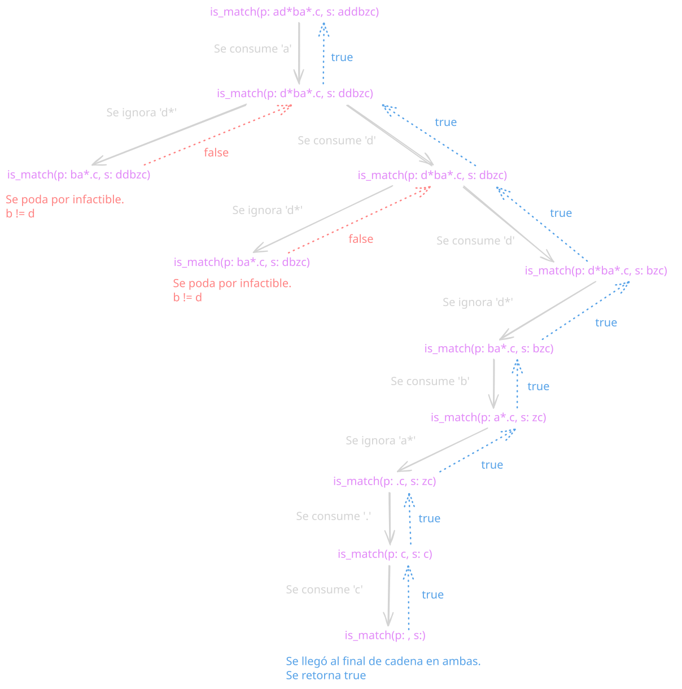

## Técnicas utilizadas
Búsqueda de coincidencias exhaustivas mediante **backtracking**. Vamos a realizar lookahead (echar un vistazo) desde el carácter actual al carácter siguiente para decidir si es necesario ramificar la ambigüedad que plantea el carácter \*

Si es necesario ramificar, primero se ramificará el caso donde sea necesario ignorar `x*`. Luego, si es necesario, se remificará el caso donde se necesita consumir al menos un carácter del tipo `x*`.

## Idea de la solución
El problema pide verificar si una cadena `s` matchea un patrón `p` que puede contener `.` (cualquier carácter) y `*` (cero o más del carácter anterior).

La recursión avanza consumiendo un carácter a la vez de `s` y `p`. El backtracking aparece en el operador `*`: no se sabe de antemano cuántas veces repetir, entonces se prueban ambas ramas y se retrocede si ninguna lleva a una solución:

- **Rama 1:** El `*` consume cero veces → se salta el par `x*` en el patrón.
- **Rama 2:** El `*` consume una vez → se avanza en s y se queda en `x*` para seguir consumiendo.

Se colocarán estas dos ramificaciones con el operador lógico OR entre ellas, ya que si la primera (la que ignora `x*`) devuelve `true`, no será necesario ramificar el caso donde se precise consumir al menos uno.

**Condición:** <*no_consumo_caracter*> || <*consumo_caracter*>

## Código
```python
MIN_LENGTH_STRING = 1
MAX_LENGTH_STRING = 20
MIN_LENGTH_PATRON = 1
MAX_LENGTH_PATRON = 20

def is_match(s: str, p: str) -> bool:
   if not (MIN_LENGTH_STRING <= len(s) <= MAX_LENGTH_STRING):
       raise ValueError("La cadena está fuera de rango")
   if not (MIN_LENGTH_PATRON <= len(p) <= MAX_LENGTH_PATRON):
       raise ValueError("El patrón está fuera de rango")


   def helper(index_s: int, index_p: int) -> bool:
       if index_p == len(p):
           return index_s == len(s)


       first_match = (index_s < len(s) and
                      (p[index_p] == '.' or p[index_p] == s[index_s]))


       if index_p + 1 < len(p) and p[index_p + 1] == '*':
           return (helper(index_s, index_p + 2)
                   or (first_match and helper(index_s + 1, index_p)))


       return first_match and helper(index_s + 1, index_p + 1)


   return helper(0, 0)
```

## Traza de ejemplo
Buscamos la solución para 
- **String:** addbzc
- **Patrón:** ad\*ba\*.c

| Llamada | p | s | index_p | index_s | Acción |
|:-|:-|:-|:-|:-|:-|
| 1 | ad\*ba\*.c | addbzc | 0 | 0 | `p[index_p] = a` coincide con `s[index_s] = a` y el siguiente no es `*` → se consume **a** |
| 2 | ad\*ba\*.c | addbzc | 1 | 1 | `p[index_p] = d` coincide con `s[index_s] = d` y el siguiente es `*` → se ramifica ignorando `d*`|
| 3 | ad\*ba\*.c | addbzc | 3 | 1 | `p[index_p] = b` no coincide con `s[index_s] = d` y el siguiente no es `*` → se retorna `false` a llamada 2 |
| 2 | ad\*ba\*.c | addbzc | 1 | 1 | Se volvió a la llamada 2. Como la primera rama retornó `false` -> se ramifica probando si hay más `d`|
| 4 | ad\*ba\*.c | addbzc | 1 | 2 | `p[index_p] = d` coincide con `s[index_s] = d` y el siguiente es `*` → se ramifica ignorando `d*`|
| 5 | ad\*ba\*.c | addbzc | 3 | 2 | `p[index_p] = b` no coincide con `s[index_s] = d` y el siguiente no es `*` → se retorna `false` a llamada 4|
| 4 | ad\*ba\*.c | addbzc | 1 | 2 | Se volvió a la llamada 4. Como la primera rama retornó `false` -> se ramifica probando si hay más `d`|
| 6 | ad\*ba\*.c | addbzc | 1 | 3 | `p[index_p] = d` no coincide con `s[index_s] = b` y el siguiente es `*` → se ramifica ignorando `d*`|
| 7 | ad\*ba\*.c | addbzc | 3 | 3 | `p[index_p] = b` coincide con `s[index_s] = b` y el siguiente no es `*` → se consume **b**|
| 8 | ad\*ba\*.c | addbzc | 4 | 4 | `p[index_p] = a` no coincide con `s[index_s] = z` y el siguiente es `*` → se ramifica ignorando `a*`|
| 9 | ad\*ba\*.c | addbzc | 6 | 4 | `p[index_p] = .` coincide con `s[index_s] = z` y el siguiente no es `*` → se consume **z**|
| 10 | ad\*ba\*.c | addbzc | 7 | 5 | `p[index_p] = c` coincide con `s[index_s] = c` y `index_p + 1 == len(p)` → se consume **c**|
| 11 | ad\*ba\*.c | addbzc | 8 | 6 | `index_p == len(p)` y `index_s == len(s)` → se retorna `true`|


### Gráfico


## Complejidad

### Temporal
$O(2^{(m + n)})$ en el peor caso, siendo $m = |s| \land n = |p|$ . Esto sucede al ramificar dos veces cuando ocurre que el patrón contiene una letra junto con `*`.

La primera ramificación ocurre ignorando `x*`. Esta, a su vez, realiza ambas ramificaciones si lo requiere.

Una vez que la primera ramificación retorna, si retornó falso, se ejecutará la segunda rama. Es así como las llamadas crecen exponencialmente en base 2.

### Espacial
$O(m + n)$ es la complejidad espacial, lo que corresponde a la cantidad de llamadas que ocurren y se almacenan en el [stack](../../grimorio/data-structures/stack.md) a lo sumo $n + m$ veces. Esto se ve cuando el patrón coincide con la cadena, ya que si se consumió todo el patrón, la cadena tiene que estar completamente consumida para retornar verdadero.

## Cuándo usar esta técnica
### Favorable cuando
- La longitud de la cadena y el patrón es acotado. En este caso, el peor caso teórico es $O(2^{40})$ dado por las restricciones de longitud impuestos en el problema.
- La poda por cortocircuito es efectiva en el caso promedio. En el caso de los lenguajes como Python, el `or` y el `and` de son lazy, es decir, en cuanto conocen el resultado, no evalúan el resto.

### Limitaciones
- Recalcula subproblemas repetidos cuando ocurren las ramificaciones.
- No escala bien cuando los límites de longitud crecen.
- Patrones que contienen muchas ambigüedades y terminan no matcheando al final degradan el algoritmo. 
    - Ejemplo: `s = "aaaaaaaaaaaaaaaaaab"` y `p = "a*a*a*a*a*a*a*a*c"` Ninguna poda ayuda: debe explorar todo antes de concluir `False`.

## Comparaciones
### Solución programación dinámica
En comparación a las soluciones planteadas con programación dinámica podemos concluir que al no usar memorización, esta solución queda muy degradada al ocurrir el cálculo constante de subproblemas superpuestos. Esto lo vemos en la complejidad temporal ya que en caso de programación dinámica se concluyó que tiene en el peor caso una complejidad temporal de $O(n \times m)$.
