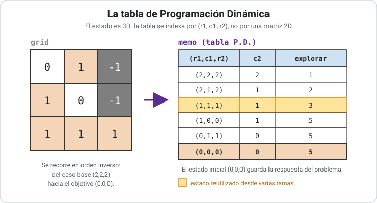

> Solución para el problema [Cherry Pickup (LeetCode #741)](0741_cherry_pickup.md).

### Técnicas utilizadas

- **Programación Dinámica (PD):** se descompone el problema en subproblemas que se **solapan**, se resuelve cada uno **una sola vez** y se guarda su resultado para reutilizarlo. Es aplicable porque el problema tiene **subestructura óptima** (la mejor solución global se arma con las mejores soluciones de sus subproblemas) y **subproblemas superpuestos** (el mismo estado se alcanza por muchos caminos).
- **Memoización (PD *top-down*):** se conserva la recursión natural de la [fuerza bruta](0741_cherry_pickup-fuerza-bruta.md) y se la envuelve con un cache: antes de computar un estado se consulta si ya fue resuelto.

### Idea de la solución

La recursión de los **dos recolectores** ya identifica el estado mínimo: `(r1, c1, r2)`, con `c2 = r1 + c1 - r2` deducible.

**¿Por qué hay $O(N^3)$ estados?** Porque el estado tiene exactamente **tres coordenadas libres**, y cada una recorre a lo sumo los `N` valores de una dimensión de la grilla:

- `r1` ∈ {0 … N-1} → `N` valores
- `c1` ∈ {0 … N-1} → `N` valores
- `r2` ∈ {0 … N-1} → `N` valores

Su producto da `N × N × N = N^3` combinaciones posibles. La cuarta coordenada, `c2`, **no cuenta**: no es libre, queda determinada por las otras tres (`c2 = r1 + c1 - r2`). Ésa es justamente la ganancia de la [reducción de estado](0741_cherry_pickup.md): si el estado fuera `(r1, c1, r2, c2)` habría `O(N^4)` estados y la tabla —y el tiempo— crecerían un orden más.

`N^3` es una **cota superior**: muchas de esas ternas son inalcanzables (por ejemplo, las que dan `c2` fuera de la grilla, o `r2 > r1 + c1`). Pero como sólo buscamos el orden de crecimiento, alcanza con acotar: los estados **realmente visitados** son a lo sumo `N^3`, y eso ya es polinómico.

La PD ataca el desperdicio de la fuerza bruta, que visita esos mismos `O(N^3)` estados una cantidad **exponencial** de veces porque cada `(r1, c1, r2)` se alcanza por múltiples combinaciones de movimientos previos. La **primera** vez que se resuelve un estado, su resultado se guarda en una tabla de memoización (un [[diccionario]] indexado por `(r1, c1, r2)`); las veces siguientes se devuelve el valor cacheado en `O(1)`. Así, cada estado se computa **una única vez**, transformando el costo de exponencial a polinómico sin alterar el resultado.


### La recurrencia

**Subproblema:** $explorar(r_1, c_1, r_2)$ = máximas cerezas recolectables desde el estado en que el recolector A está en $(r_1, c_1)$ y el B en $(r_2, c_2)$, hasta que ambos lleguen a $(N-1, N-1)$.

Llamando $cerezas$ a lo que se recoge en el paso actual (contando una sola vez si ambos pisan la misma celda):

$$
cerezas = grid[r_1][c_1] + \begin{cases} grid[r_2][c_2] & \text{si } (r_1,c_1) \neq (r_2,c_2) \\ 0 & \text{si coinciden} \end{cases}
$$

la recurrencia queda:

$$
explorar(r_1, c_1, r_2) =
\begin{cases}
-\infty & \text{si } (r_1,c_1) \text{ o } (r_2,c_2) \text{ es inválida} \\[4pt]
cerezas & \text{si } r_1 = N-1 \text{ y } c_1 = N-1 \\[4pt]
cerezas + \max \begin{cases}
  explorar(r_1+1,\; c_1,\; r_2+1) \\
  explorar(r_1+1,\; c_1,\; r_2) \\
  explorar(r_1,\; c_1+1,\; r_2+1) \\
  explorar(r_1,\; c_1+1,\; r_2)
\end{cases} & \text{en otro caso}
\end{cases}
$$

siendo $c_2 = r_1 + c_1 - r_2$, y con una celda *inválida* si cae fuera de la grilla o contiene una espina (`-1`). El $-\infty$ propaga la invalidez: cualquier rama que pase por una espina queda descartada por el `max`.

La respuesta final es $\max(0,\; explorar(0, 0, 0))$: el `max` con `0` cubre el caso en que **todo** camino esté bloqueado.

### Código

Se parte de la recursión de la fuerza bruta y se le aplican los cuatro pasos de la estrategia *top-down*:

```python
def cherry_pickup(grid):
    n = len(grid)
    memo = {}                                  # 1. la memoria, viva entre invocaciones

    def explorar(r1, c1, r2):
        c2 = r1 + c1 - r2
        if (r1 >= n or c1 >= n or r2 >= n or c2 >= n or
                grid[r1][c1] == -1 or grid[r2][c2] == -1):
            return float('-inf')

        clave = (r1, c1, r2)                   # 2. la key del subproblema
        if clave in memo:                      # 3. ¿ya fue resuelto?
            return memo[clave]                 #    sí -> se devuelve en O(1)

        cerezas = grid[r1][c1]
        if (r1, c1) != (r2, c2):
            cerezas += grid[r2][c2]

        if r1 == n - 1 and c1 == n - 1:
            memo[clave] = cerezas              # 4. guardar antes de retornar
        else:
            memo[clave] = cerezas + max(
                explorar(r1 + 1, c1,     r2 + 1),
                explorar(r1 + 1, c1,     r2    ),
                explorar(r1,     c1 + 1, r2 + 1),
                explorar(r1,     c1 + 1, r2    ),
            )
        return memo[clave]

    return max(0, explorar(0, 0, 0))
```

La **recursión** (el caso base, las 4 transiciones y el `max`) es la misma que la de la [fuerza bruta](0741_cherry_pickup-fuerza-bruta.md): no cambia *qué* se calcula ni el resultado. Pero el **cuerpo no es idéntico**: la PD agrega dos operaciones que la fuerza bruta no tiene —la **consulta** a la memoria antes de computar (paso 3) y la **escritura** del resultado antes de retornar (paso 4)—. Esas dos líneas son exactamente lo que convierte el algoritmo de inviable a eficiente: sin ellas no hay reutilización de subproblemas y no hay PD.

> En Python, el decorador `@lru_cache(maxsize=None)` sobre `explorar` produce el mismo efecto escondiendo los pasos 1–4 en una sola línea. Lo escribimos con el diccionario a la vista porque el mecanismo —y no el azúcar sintáctico— es el que explica el cambio de complejidad.

### Traza de ejemplo

Sobre la misma instancia (`N = 3`, respuesta `5`). La rama óptima es la misma que en la fuerza bruta; lo que cambia es **qué ocurre con los estados repetidos**:

| Estado `(r1,c1,r2)` | `c2` | ¿En cache? | Acción |
| ------------------- | ---- | ---------- | ------ |
| `(0,0,0)` | 0 | no | computa → explora 4 hijos |
| `(0,1,1)` | 0 | no | computa (cerezas `1+1=2`) |
| `(1,1,2)` | 0 | no | computa (cerezas `0+1=1`) |
| `(2,1,2)` | 1 | no | computa (coinciden → `1`) |
| `(2,2,2)` | 2 | no | caso base → `1` |
| `(2,1,2)` | 1 | **sí** | devuelve valor cacheado en `O(1)` |
| `(1,1,2)` | 0 | **sí** | devuelve valor cacheado en `O(1)` |

Las dos últimas filas muestran el ahorro: estados que la fuerza bruta volvería a expandir por completo, la PD los resuelve consultando la tabla. El valor final propagado a `(0,0,0)` es `5`, y `max(0, 5) = 5`.



Al igual que en los problemas de tabla 2D vistos en clase, la tabla se llena desde los casos base hacia el objetivo; la diferencia es que acá se indexa por la **terna** `(r1, c1, r2)` y no por una matriz, porque el estado tiene tres coordenadas libres. La celda `(0,0,0)` es la que contiene la respuesta del problema.

### Complejidad

En cualquier algoritmo de PD el tiempo total sale de multiplicar dos cosas independientes:

$$T = (\text{cantidad de estados distintos}) \times (\text{trabajo por estado})$$

Esta identidad vale **gracias a la memoización**: como cada estado se computa una sola vez, basta contar los estados y ver cuánto cuesta resolver *uno* —sin contar el costo de sus llamadas recursivas, que ya están contabilizadas en sus propios estados—. Aplicándola:

- **Cantidad de estados:** $O(N^3)$, por las tres coordenadas libres `(r1, c1, r2)` justificadas más arriba.
- **Trabajo por estado:** $O(1)$. Al resolver un estado se hace una cantidad **constante** de operaciones: deducir `c2`, chequear límites y espinas, sumar a lo sumo dos celdas, y tomar el `max` de **exactamente 4** valores. Ese 4 es una constante fija (no depende de `N`), y cada una de esas 4 llamadas cuesta `O(1)` porque devuelve un valor ya cacheado o inicia el cómputo de *otro* estado, que se cuenta aparte.

- **Temporal:** $O(N^3) \times O(1) = O(N^3)$. Para `N = 50` son a lo sumo `50³ = 125 000` estados, cada uno con trabajo constante: trivial para una computadora.

  Es útil ver **dónde se fue el exponencial**: la fuerza bruta también hace `O(1)` de trabajo por llamada, pero realiza $O(4^{2N})$ **llamadas** porque revisita los mismos estados una y otra vez. La memoización no acelera cada paso; lo que hace es **acotar la cantidad de llamadas que hacen trabajo real** al número de estados distintos. El tiempo deja de depender de la *forma del árbol de recursión* y pasa a depender del *tamaño del espacio de estados*.

- **Espacial:** $O(N^3)$. Domina la tabla de memoización: en el peor caso guarda un valor por cada estado alcanzado. La pila de recursión aporta $O(N)$ —su profundidad es la longitud de un camino, `2(N-1)`—, despreciable frente a la tabla. Éste es el precio explícito de la PD: **se compra tiempo pagando memoria**.

### Cuándo usar esta técnica

La PD es la elección indicada cuando se reconocen las **dos señales** que aquí están presentes: **subestructura óptima** y **subproblemas superpuestos**. La pista práctica es directa: si una solución recursiva natural recalcula los mismos estados una y otra vez, memoizar suele bajar el costo de exponencial a polinómico.

Sus **limitaciones**: paga memoria por velocidad (aquí $O(N^3)$, que para `N` muy grande podría ser un problema), y requiere que el estado sea **acotado y bien identificado** —si los estados casi no se repiten, la memoización no ayuda y sólo agrega overhead.

Comparada con la [Fuerza Bruta](0741_cherry_pickup-fuerza-bruta.md), es **estrictamente superior para este problema**: explora **la misma recursión** y llega al mismo resultado, pero al agregarle la memoria pasa de $O(4^{2N})$ a $O(N^3)$ en tiempo, a cambio de subir de $O(N)$ a $O(N^3)$ en memoria. El intercambio es claramente favorable: la memoria crece de forma polinómica mientras que el tiempo que se ahorra era exponencial. La fuerza bruta sólo conviene como referencia conceptual o como oráculo de testing en instancias diminutas; **para resolver el problema de verdad, se usa la PD**.

> Variante: esta versión es *top-down* (memoización). Existe una formulación *bottom-up* equivalente que llena una tabla 3D iterando `t = 0 … 2(N-1)`, con la misma complejidad `O(N^3)` y la ventaja de evitar el límite de profundidad de recursión.

### Referencias

- Cormen, Leiserson, Rivest, Stein — *Introduction to Algorithms* (3ª ed.), Cap. 15: Dynamic Programming.
- Documentación de Python — `functools.lru_cache`: https://docs.python.org/3/library/functools.html#functools.lru_cache
