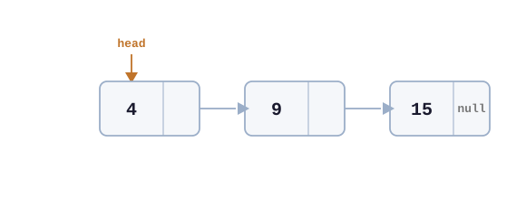

## 1. Qué es y cómo funciona

### Intuición
Una lista simplemente enlazada funciona como una cadena: cada elemento está ligado al siguiente a través de un puntero. Permite insertar y eliminar elementos sin mover el resto.

### Definición y propiedades
- Estructura dinámica de nodos
- Cada nodo tiene: dato + referencia al siguiente
- Acceso secuencial (no hay acceso directo por índice)
- El último nodo apunta a `null`

### Representación


La imagen muestra una lista de tres nodos enlazados. Cada nodo está dividido en dos secciones: la parte izquierda contiene un valor o dato, y la parte derecha contiene un puntero que apunta al siguiente nodo. El último nodo tiene su puntero apuntando a null, indicando el final de la lista. Un puntero externo llamado head señala al primer nodo desde la izquierda, marcando la entrada a la estructura.

## 2. Operaciones y complejidad

### Operaciones principales
- `insertarInicio(x)` crea un nodo que apunta a la cabecera anterior de la lista
- `insertarFinal(x)` recorre toda la lista hasta el final y el último nodo apunta al nuevo nodo creado
- `insertarOrdenado(x)` recorre la lista hasta encontrar la posición correcta; el anterior apunta al nuevo nodo y este al siguiente
- `eliminar(x)` desvincula el nodo de la lista; el nodo anterior apunta al siguiente del eliminado
- `buscar(x)` recorre la lista buscando el elemento pasado por parámetro
- `recorrer()` recorre la lista hasta el final

### Complejidad
- `insertarInicio`: $O(1)$
- `insertarOrdenado`: $O(n)$
- `insertarFinal`: $O(n)$
- `eliminar`: $O(n)$
- `buscar`: $O(n)$
- `recorrer`: $O(n)$
- Espacio: $O(n)$
> **Nota:** La complejidad de inserciones al inicio y final se invierten si el puntero va a tail

### Detalles operativos
- Puede haber overflow (solo si se agota la memoria del sistema)
- Puede haber underflow (al intentar borrar o leer en una lista vacía)
- No permite búsqueda eficiente ni acceso directo, ya que es $O(n)$
- La función  `insertarOrdenado(x)` asume que la lista se encuentra ordenada.

### Casos a considerar
- Cuando se borra un elemento de una lista con un unico nodo, se borra donde se encuentra el `head`. Se debe modificar el `head` a lo que corresponda (otro nodo o `null`).
- Si hay varios nodos con el mismo dato, tanto `buscar(x)` como `eliminar(x)` solo actuan sobre la primera aparición. Si se desea eliminar todas las ocurrencias, hay que iterar explícitamente en vez de retornar en la primera coincidencia

## 3. Implementación

### Idea de implementación
Mantener una colección donde cada elemento se enlaza con el siguiente. Se usa `head` para acceder al primer elemento y, desde ahí, recorrer los demás.

### Invariantes
- `head` apunta al primer nodo o es `null`
- Cada nodo apunta al siguiente
- El último nodo apunta a `null`

### Ejemplo de código

```python
class Nodo:
    def __init__(self, dato):
        self.dato = dato
        self.sig = None

class Lista:
    def __init__(self):
        self.head = None

    def insertar_inicio(self, x):
        nuevo = Nodo(x)
        nuevo.sig = self.head
        self.head = nuevo

    def insertar_ordenado(self, x):
        nuevo = Nodo(x)
        if self.head is None or self.head.dato >= x:
            nuevo.sig = self.head
            self.head = nuevo
            return
        actual = self.head
        while actual.sig and actual.sig.dato < x:
            actual = actual.sig
        nuevo.sig = actual.sig
        actual.sig = nuevo
    
    def insertar_final(self, x):
        nuevo = Nodo(x)
        if self.head is None:
            self.head = nuevo
            return
        actual = self.head
        while actual.sig:
            actual = actual.sig
        actual.sig = nuevo

    def eliminar(self, x):
        actual = self.head
        anterior = None
        while actual:
            if actual.dato == x:
                if anterior is None:
                    self.head = actual.sig
                else:
                    anterior.sig = actual.sig
                return
            anterior = actual
            actual = actual.sig

    def buscar(self, x):
        actual = self.head
        while actual:
            if actual.dato == x:
                return actual
            actual = actual.sig
        return None

    def recorrer(self):
        actual = self.head
        while actual:
            print(actual.dato)
            actual = actual.sig
```

#### Ejemplo de uso típico

Recorrer e imprimir todos los elementos
```python
lista = Lista()
for x in [1, 2, 3]:
    lista.insertar_final(x)

lista.recorrer()  # 1, 2, 3
```

## 4. Uso y criterio

### Casos de uso
- Cuando se inserta o se elimina frecuentemente
- Cuando no se necesita acceso directo a los elementos
- Manejo dinámico de memoria (cuando no se conoce el tamaño de antemano)
- Cuando importa el orden pero no un elemento en específico

### Cuándo NO usarla
- Cuando necesitás acceso directo a una posición específica
- Cuando recorrés constantemente toda la estructura
- Cuando el problema requiere acceso aleatorio frecuente

### Comparaciones
- **vs Array.** el array usa memoria contigua, tiene tamaño fijo y permite acceso directo $O(1)$, pero insertar o eliminar en el medio exige desplazar elementos. La lista simple crece dinámicamente y solo reubica punteros, pero su acceso es secuencial $O(n)$. Usá lista cuando haya constante alta y baja de elementos, sin recorridos frecuentes.
- **vs Lista Doble.** la lista doble permite recorrer en ambas direcciones, pero consume más memoria. La lista simple es más económica en memoria pero restringe el recorrido a un solo sentido. Elegí lista simple si la memoria es crítica y el recorrido es siempre hacia adelante.
- **vs Pila / Cola.** la pila y la cola restringen por diseño dónde podés insertar y eliminar para garantizar su comportamiento. La lista simple no tiene estas restricciones. Usá lista simple cuando necesitás operar o buscar en posiciones intermedias.

#### Ventajas
- Crecimiento dinámico
- Inserción y eliminación sin reordenamiento
- Flexibilidad y simplicidad alta

#### Desventajas
- Recorrido restringido a un solo sentido (unidireccional)
- No permite acceso directo ni búsqueda eficiente
- Overhead adicional por punteros

### Señales de reconocimiento
- "Tamaño desconocido o impredecible"
- "Funcionalidades de Undo/Redo"
- "Navegación secuencial"
- Problemas con alta frecuencia de inserciones y eliminaciones

## 5. Relaciones y extensiones

### Variantes
- Lista con puntero a tail
- [[doubly linked list]]
- Lista circular
- Lista desordenada vs. lista ordenada

### Relación con otras estructuras
- El [[stack]] y las colas son básicamente listas simples con políticas de inserción y eliminación limitadas (LIFO y FIFO respectivamente).
- Es la base para implementar árboles ya que se trata a los hijos de un nodo como una lista enlazada.
- Funciona como una solución para resolver colisiones en una [[hash table]] utilizando encadenamiento (chaining).
- Cada nodo se modela como un [[struct]] que agrupa el dato y el puntero al siguiente.

### Notas avanzadas

#### Versiones persistentes
Insertar al frente crea un nuevo head que apunta a la lista existente sin copiarla. La versión anterior queda intacta gracias al structural sharing (reutilización).
Implicancias:
- Inserción al frente $O(1)$ compartiendo todos los nodos excepto el nuevo.
- Útil para blockchain, snapshots y programación funcional (**Haskell**)
- Modificaciones en posiciones intermedias no pueden hacer sharing y copian $O(k)$ nodos previos. Siendo k la posicion modificada.

#### Concurrencia y sincronización
Inserciones y eliminaciones simultáneas pueden corromper punteros next y causar acceso a memoria inválida.
Implicancias:
- Con locks: simple de razonar, pero genera contención bajo alta carga.
- Lock-free: más complejo, problemas ABA son muy prevalentes.
- Alternativa práctica: listas thread-local o estructuras persistentes para evitar compartir estado mutable.

## 6. Referencias y recursos
- [[COR2011]] - Chapter 10.2.
