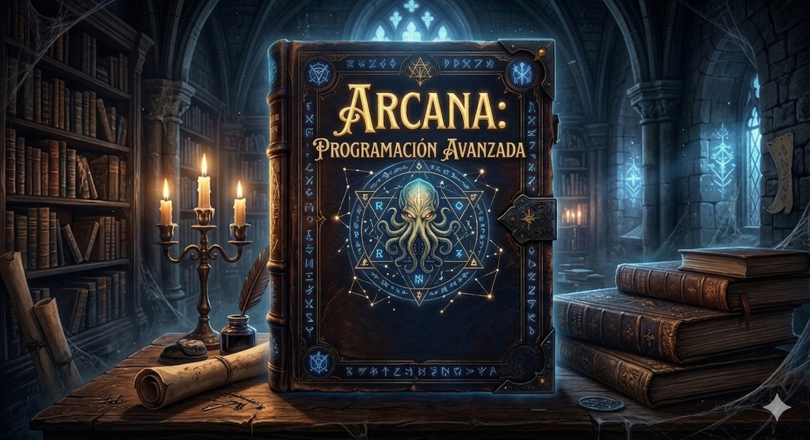

Cuentan los antiguos que el mundo del cómputo fue caos hasta que alguien descubrió que los problemas obedecen a quienes conocen su forma. Un algoritmo es un conjuro: una secuencia precisa de pasos que doblega una entrada y devuelve una salida. Una estructura de datos es el artefacto que lo contiene: la forma en que organizás la información determina qué conjuros son posibles y a qué costo. No son independientes: elegir mal el artefacto hace que el conjuro más elegante se disipe en el aire.

Este tomo se divide en dos partes. El [Grimorio](grimorio/index.md) cataloga los conjuros y los artefactos: algoritmos, estructuras, teoremas. Cada entrada tiene sus prerequisitos, sus conexiones con otras entradas, y sus casos de uso. No está pensado para leerse de corrido sino para navegarse: seguí los links, volvé cuando algo no cierre, avanzá cuando tengas el contexto.

El [Bestiario](bestiario/index.md) cataloga las criaturas: los problemas. Cada bestia tiene su naturaleza y los conjuros que la doblegan — y los que fallan al intentarlo. Un conjuro que nunca enfrentó una bestia verdadera no está aprendido: está apenas memorizado.
